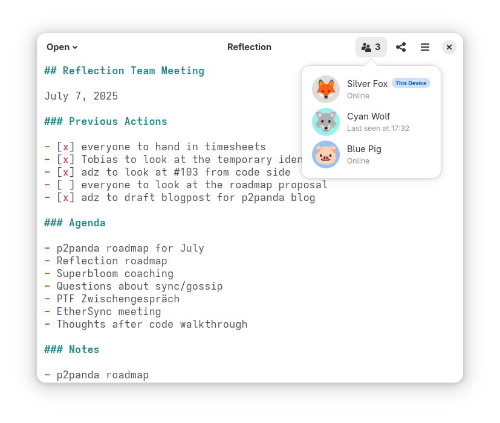
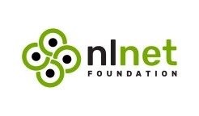
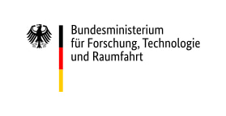

<h1 align="center">Reflection</h1>

Collaboratively take meeting notes, even when there's no internet

> [!CAUTION]
> The project is under active development and not considered stable yet. It probably won't eat your data, but no guarantees :)

## Development

### Getting Started

The [GNOME Builder IDE](https://builder.readthedocs.io/) is required to build
and run the project. It can be installed with flatpak.

1. [Install flatpak](https://flatpak.org/setup/) for your distribution.
2. Install [Builder](https://flathub.org/apps/org.gnome.Builder) for GNOME:
    `flatpak install flathub org.gnome.Builder`
3. Clone the reflection repo:
    `git clone git@github.com:p2panda/reflection.git && cd reflection`
4. Open the Builder application and navigate to the reflection repo.
   - You may be prompted to install or update the SDK in Builder.
5. Run the project with `Shift+Ctrl+Space` or click the ► icon (top-middle of
   the Builder appication).

### Multiple Instances

If you need multiple instances of the app on the same computer for testing, you can run GNOME Builder in a separate dbus session:

`dbus-run-session flatpak run org.gnome.Builder`

### Diagnostics

Set the `RUST_LOG` environment variable to your verbosity setting and filter to
enable log-based diagnostics with [tracing](https://docs.rs/tracing). Example:
`RUST_LOG=debug` or `RUST_LOG=p2panda_net=INFO` etc.

## License

[GNU General Public License v3.0](COPYING)

## Supported By

Thanks to [NLNet](https://nlnet.nl) (via [NGI Assure](https://nlnet.nl/project/P2Panda)), the [Prototype Fund](https://www.prototypefund.de/), and the [Federal Ministry of Research, Technology and Space](https://www.bmbf.de/EN/) for funding this project in 2025.

